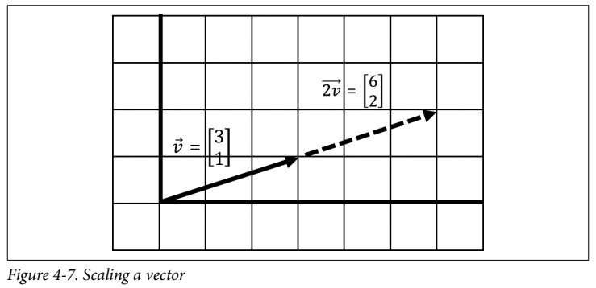
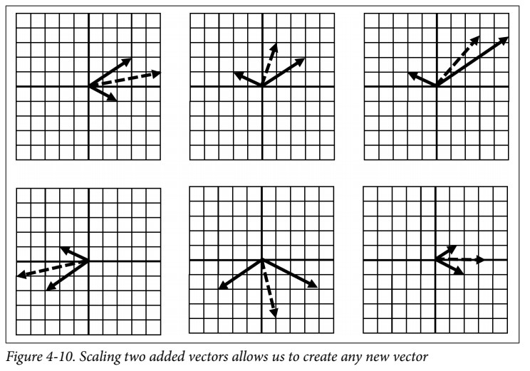
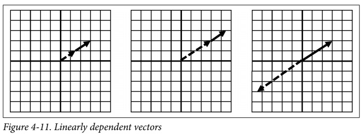
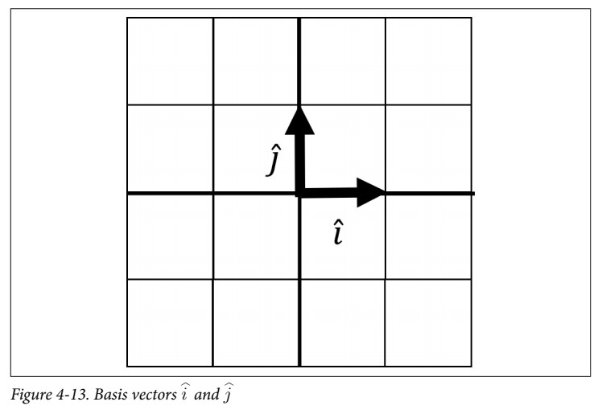
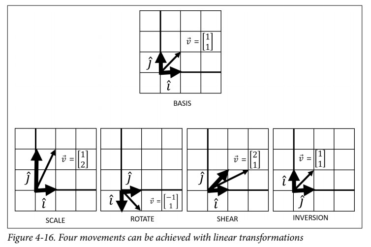

# Chapter 4: Linear Algebra
## What is a Vector?
* A _vector_ is an arrow in space with a specific direction and length, often representing a piece of data.
* In its fundamental form, it has no concept of location so always imagine its tail starts at the origin of a Cartesian plane (0,0).
* The purpose of the vector is to visually represent a piece of data.
* Below figure, shows a vector $\vec{v}$ that moves three steps in the horizontal direction and two steps in the vertical direction.
  
* We declare a vector mathematically like this:

$$
\vec{v} = \begin{bmatrix}
x \newline
y
\end{bmatrix}
$$

### Adding and Combining Vectors
* **Numerically**: simply add the respective $x$-values and then the $y$-values into a new vector

$$
\begin{align*}
\vec{v} & = \begin{bmatrix} 3 \newline 2 \end{bmatrix} \\
\vec{w} & = \begin{bmatrix} 2 \newline -1 \end{bmatrix} \\
\vec{v} + \vec{w} & = \begin{bmatrix} 3+2 \newline 2+ -1 \end{bmatrix} = \begin{bmatrix} 5 \newline 1 \end{bmatrix}
\end{align*}
$$

* **Visually**: connect one vector after the other and walk to the tip of the last vector. The point you end at is a new vector, the result of summing the two vectors.  

* It does not matter whether we add v before w or vice versa, which means it is _commutative_ and order of operation does not matter.
### Scaling Vectors
* _Scaling_ is growing or shrinking a vector’s length by multiplying or scaling it with a single value, known as a _scalar_.

* Mathematically, you multiply each element of the vector by the scalar value:

$$
\begin{align*}
\vec{v} & = \begin{bmatrix} 3 \newline 1 \end{bmatrix} \\
2\vec{v} & = 2\begin{bmatrix} 3 \newline 1 \end{bmatrix} = \begin{bmatrix} 3 \times 2 \newline 1 \times 2 \end{bmatrix} = \begin{bmatrix} 6 \newline 2 \end{bmatrix}
\end{align*}
$$
### Span and Linear Dependence
* Using adding two vectors and scaling them, we can combine two vectors and scale them to create any resulting vector we want.
* Figure below shows six examples of taking two vectors $\vec{v}$ and $\vec{w}$, and scaling and combining.
    * These vectors $\vec{v}$ and $\vec{w}$, fixed in two different directions, can be scaled and added to create any new vector $\overrightarrow {v + w}$.

* This whole space of possible vectors is called _span_.
    * When we have two vectors in two different directions, they are _linearly independent_ and have this unlimited _span_.
    * When two vectors exist in the same direction, or exist on the same line, the combination of those vectors is also stuck on the same line, limiting our _span_ to just that line. This makes them _linearly dependent_, as shown in Figure below.

* A lot of problems become difficult or unsolvable when they are linearly dependent.
    * A _linearly dependent_ set of equations can cause variables to disappear and make the problem unsolvable.
    * If you have _linear independence_, that flexibility to create any vector you need from two or more vectors becomes invaluable to solve for a solution!

## Linear Transformations
In _linear transformations_ we use a vector to transform another vector in a function-like manner.
### Basis Vectors
* _Basis Vectors_ are used to describe transformations on other vectors.
    * They are two simple vectors $\hat{i}$ and $\hat{j}$
    * They typi‐ cally have a length of 1 and point in perpendicular positive directions as visualized in Figure below:
    
* Our basis vector is expressed in a 2 × 2 matrix, where the first column is $\hat{i}$ and the second column is $\hat{j}$:

$$
\begin{align*}
\hat{i} & = \begin{bmatrix} 1 \newline 0 \end{bmatrix} \\
\hat{j} & = \begin{bmatrix} 0 \newline 1 \end{bmatrix} \\
\text{basis} & = \begin{bmatrix} 1 & 0 \newline 0 & 1 \end{bmatrix}
\end{align*}
$$

* In _linear transformation_, We can use $\hat{i}$ and $\hat{j}$ to create any vector we want by **scaling** and **adding** them.
* Generally, with linear transformations, there are four movements you can achieve, as shown in Figure below:

### Matrix Vector Multiplication
* The formula to transform a vector $\vec{v}$ given basis vectors $\hat{i}$ and $\hat{j}$ packaged as a matrix is:

$$
\begin{align*}
\begin{bmatrix} x_{new} \newline y_{new} \end{bmatrix} & = \begin{bmatrix} a & b \newline c & d \end{bmatrix} \begin{bmatrix} x \newline y \end{bmatrix} \\
& = \begin{bmatrix} ax + by \newline cx + dy \end{bmatrix}
\end{align*}
$$

* This transformation of a vector by applying basis vectors is known as _matrix vector multiplication_ also known as _dot product_.

## Matrix Multiplication
* Think of _matrix multiplication_ as applying multiple transformations to a vector space.
* Each transformation is like a function, where we apply the innermost first and then apply each subsequent transformation outward.

$$
\begin{align*}
\begin{bmatrix} 1 & 1 \newline 0 & 1 \end{bmatrix} \begin{bmatrix} 0 & -1 \newline 1 & 0 \end{bmatrix} \begin{bmatrix} x \newline y \end{bmatrix} & = \begin{bmatrix} 1 & 1 \newline 0 & 1 \end{bmatrix} \left(\begin{bmatrix} 0 & -1 \newline 1 & 0 \end{bmatrix} \begin{bmatrix} x \newline y \end{bmatrix} \right) \\
& = \begin{bmatrix} 1 & 1 \newline 0 & 1 \end{bmatrix} \begin{bmatrix} -y \newline x \end{bmatrix} \\
& = \begin{bmatrix} x-y \newline x \end{bmatrix}
\end{align*}
$$

> **Note**  
> The order you apply each transformation matters!  
> So matrix dot products are not commutative, meaning you cannot flip the order and expect the same result!

* In the below example, we can also consolidate these two transformations by using this formula, apply‐ ing one transformation onto the last.

$$
\begin{bmatrix} a & b \newline c & d \end{bmatrix} \begin{bmatrix} e & f \newline g & h \end{bmatrix} = \begin{bmatrix} ae + bg & af + bh \newline ce + dy & cf + dh \end{bmatrix}
$$

* So we can actually consolidate these two separate transformations (rotation and shear) into a single transformation:

$$
\begin{align*}
\begin{bmatrix} 1 & 1 \newline 0 & 1 \end{bmatrix} \begin{bmatrix} 0 & -1 \newline 1 & 0 \end{bmatrix} \begin{bmatrix} x \newline y \end{bmatrix} & = \begin{bmatrix} 1 & -1 \newline 1 & 0 \end{bmatrix} \begin{bmatrix} x \newline y \end{bmatrix} \\
& = \begin{bmatrix} x-y \newline x \end{bmatrix}
\end{align*}
$$

* To execute this in Python using NumPy, you can combine the two matrices simply using the `matmul()` or `@` operator

[<<Previous](../statistics_hypothesis_testing/README.md) | [Next>>]()