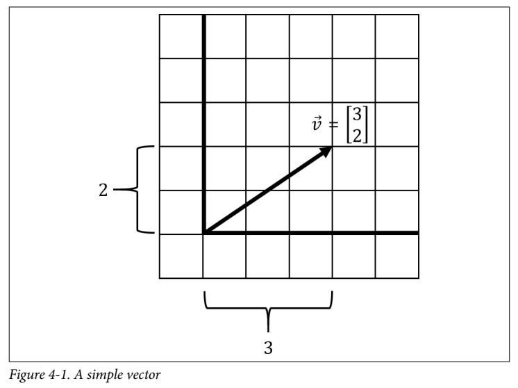
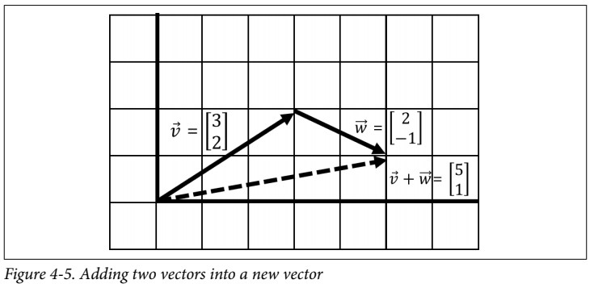

# Chapter 4: Linear Algebra
## What is a Vector?
* A _vector_ is an arrow in space with a specific direction and length, often representing a piece of data.
* In its fundamental form, it has no concept of location so always imagine its tail starts at the origin of a Cartesian plane (0,0).
* The purpose of the vector is to visually represent a piece of data.
* Below figure, shows a vector $\vec{v}$ that moves three steps in the horizontal direction and two steps in the vertical direction.
  
* We declare a vector mathematically like this:

$$
\vec{v} = \begin{bmatrix}
x \\
y
\end{bmatrix}
$$

### Adding and Combining Vectors
* **Numerically**: simply add the respective $x$-values and then the $y$-values into a new vector

$$
\begin{align*}
\vec{v} & = \begin{bmatrix} 3 \\ 2 \end{bmatrix} \\
\vec{w} & = \begin{bmatrix} 2 \\ -1 \end{bmatrix} \\
\vec{v} + \vec{w} & = \begin{bmatrix} 3+2 \\ 2+ -1 \end{bmatrix} = \begin{bmatrix} 5 \\ 1 \end{bmatrix}
\end{align*}
$$

* **Visually**: connect one vector after the other and walk to the tip of the last vector. The point you end at is a new vector, the result of summing the two vectors.  

* It does not matter whether we add v before w or vice versa, which means it is _commutative_ and order of operation does not matter.

[<<Previous](../statistics_hypothesis_testing/README.md) | [Next>>]()