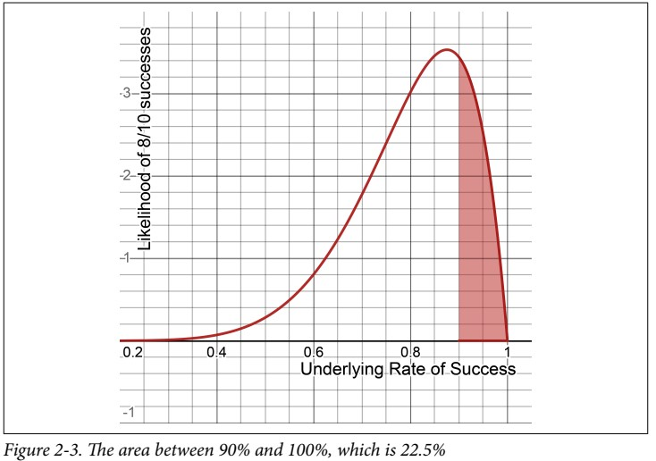

# Chapter 2 - Probability
The most popular way to express probability is as a percentage, as in _There is a 70% chance my flight will be late._ We will call this probability $P(X)$ , where $X$ is the event of interest.

$$
\begin{align*}
P(X) & = 0.70 \\
P(\text{not } X) &= 1 - 0.70 = 0.30
\end{align*}
$$

* **Probability** is about quantifying predictions of events yet to happen.
    * Probabilities of all possible mutually exclusive outcomes for an event (meaning only one outcome can occur, not multiple) must sum to 1.0 or 100%.
    * probability can be expressed as an odds $O(X)$ such as 7:3, 7/3, or 2.33

$$
\begin{align*}
P(X) & = \frac{O(X)}{1 + O(X)} \\
O(X) & = \frac{P(X)}{1 - P(X)}
\end{align*}
$$

* **Likelihood** is measuring the frequency of events that already occurred.

## Probability vs Statistics
* **Probability** is purely theoretical of how likely an event is to happen and does not require data.
* **Statistics**, on the other hand, cannot exist without data and uses it to discover probability and provides tools to describe data.

## Probability Math
### Joint Probabilities
The probability that both events will occur together. This is known as a _joint probability_.

$$
\begin{align*}
\text{If } A \text{ and } B \text{ are independent events, Then:} \\
P(A \cap B) = P(A) \times P(B)
\end{align*}
$$
### Union Probabilities
When we deal with **OR** operations with probabilities, this is known as a _union probability_.
#### Mutually exclusive events
* _Mutually exclusive_ events are events that cannot occur simultaneously.
* For example, if I roll one die I cannot simultaneously get a 4 and a 6. I can only get one outcome.
* To get the union probability for _mutually exclusive_ events, simply add them together.

$$
P(A \cup B) = P(A) + P(B)
$$

#### Nonmutually exclusive events
* _Nonmutually exclusive_ events are events that can occur simultaneously.
* To calculate probability in this case, we use the _sum rule of probability_ and ensures every joint event is counted only once:

$$
\begin{align*}
P(A \cup B) & = P(A) + P(B) - P(A \cap B) \\
& = P(A) + P(B) - \left( P(A) \times P(B) \right)
\end{align*}
$$

* **Note** that this formula will work also with [_mutually exclusive_ events](#mutually-exclusive-events) as the joint probability $P(A \cap B)$ is going to be $0$.

## Conditional Probability and Bayes’ Theorem
* **Conditional probability** is the probability of an event $A$ occurring given event $B$ has occurred.
* It is typlically expressed as $P(A|B)$
* The direction of conditional probability matters as $P(A|B) \neq P(B|A)$
* To flip the conditional probability, we have **Bayes’ Theorem**:

$$
P(A|B) = \frac{P(B|A)*P(A)}{P(B)}
$$

### Joint and Union Conditional Probabilities
Our joint probability formula:

$$
\boxed{P(A \cap B) = P(B) \times P(A|B)}
$$

Our Union probability formula:

$$
\boxed{P(A \cup B ) = P(A) + P(B) - (P(A|B) \times P(B))}
$$

## Binomial Distribution
* The _binomial distribution_ measures how likely $k$ successes can happen out of $n$ trials given $p$ probability.
    * Assuning we the underlying probability of an experiment is 90% so _binomial distribution_ helps us determine the likelihood of 80% success.
    * If we add up the probability of eight or fewer successes (80% success), we would get 0.2639. This means there is a 26.39% chance we would see 80% or fewer successes even if the underlying success rate is 90%.
    
* The formula for _binomial distribution_

$$
\text{Binomial distribution} = \frac{n!}{k! \times (n-k)!} \cdot p^{k} \cdot (1-p)^{n-k}
$$

## Beta Distribution
* The _beta distribution_ allows us to see the likelihood of different underlying probabilities for an event to occur given _alpha_ successes and _beta_ failures.
* A chart of the beta distribution given 8 successes and 2 failures is shown below:
    * The x-axis represents all underlying rates of success from $0.0$ to $1.0$ (0% to 100%).
    * The y-axis represents the likelihood of that probability given 8 successes and 2 failures.
  
* The _beta distribution_ is a continuous function, meaning it forms a continuous curve of decimal values.
* A given density value on the y-axis is not a probability. We instead find probabilities using areas under the curve.
    * The _beta distribution_ is a type of probability distribution, which means the area under the entire curve is $1.0$, or 100%.
* To find a probability, we need to find the area within a range.
    * For example, if we want to evaluate the probability 8/10 successes would yield 90% or higher success rate, we need to find the area between 0.9 and 1.0, which is 0.225, as shaded in below figure:
    
* Every continuous probability distribution has a _cumulative density function_ (CDF), which calculates the area up to a given x-value.
    * It is easy enough to use SciPy with its `beta.cdf()` function which calculates area only to the left of our boundary, not the right.
      
    
[<<Previous](../README.md) | [Next>>](../statistics_hypothesis_testing/README.md)