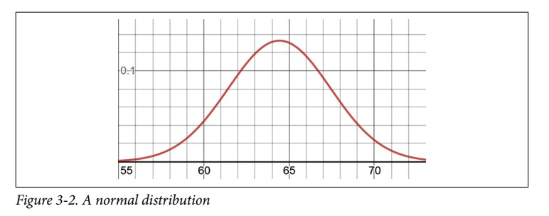
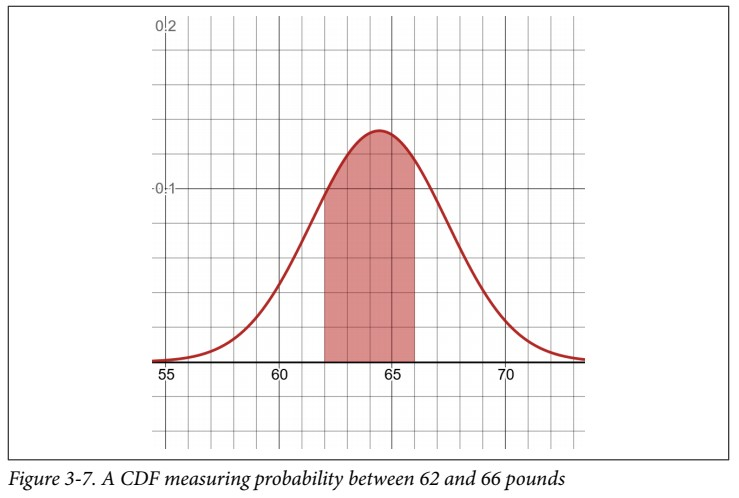
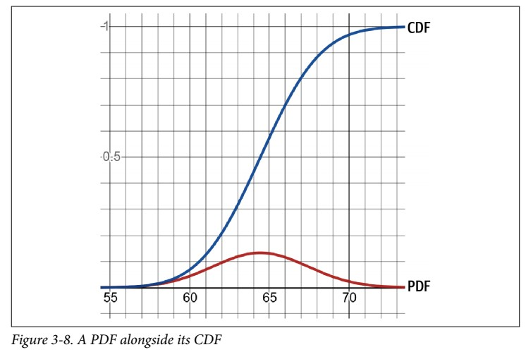
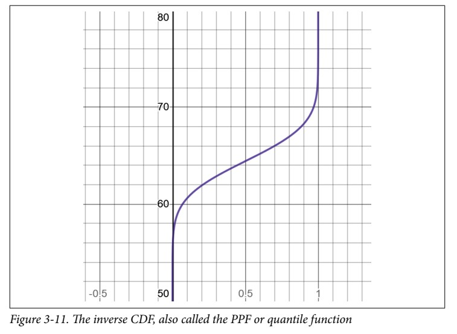
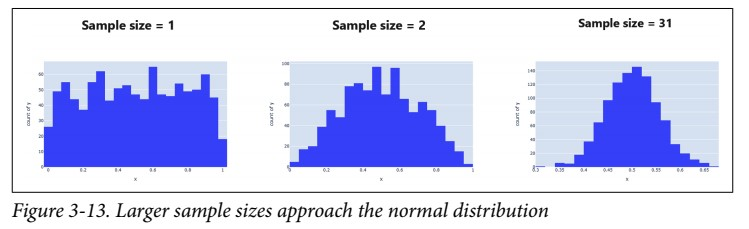
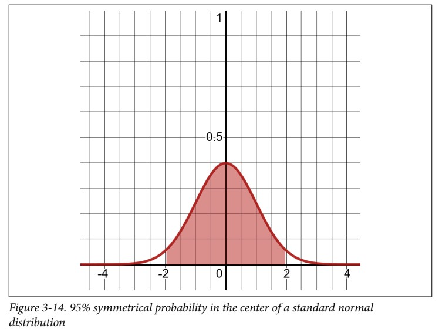
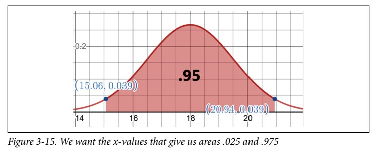
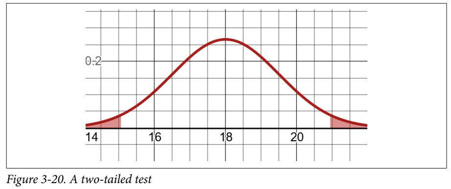
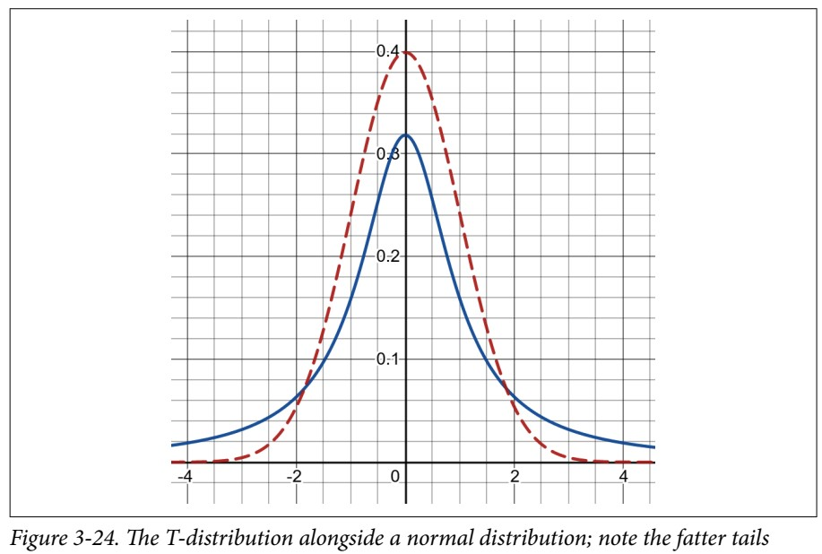

# Chapter 2: Descriptive and Inferential Statistics
_Statistics_ is the practice of collecting and analyzing data to discover findings that are useful or predict what causes those findings to happen.
## What is Data?
### Descriptive Versus Inferential Statistics
* _Descriptive Statistics_ is the branch we use to summarize data; calculating mean, median, mode, charts, bell curves, and other tools to describe data.
* _Inferential Statistics_ is the branch that tries to uncover attributes about a larger population, often based on a sample.
### Populations, Samples, and Bias
* A **Population** is a particular group of interest we want to study, such as _all seniors over the age of 65 in the North America_, _all golden retrievers in Scotland_, or _current high school sophomores at Los Altos High School_.
    * We have boundaries on defining our population.
    * Some of these boundaries are broad and capture a large group over a vast geography or age group.
    * Others are highly specific and small such as the sophomores at Los Altos High School.
    * How you hone in on defining a population depends on what you are interested in studying.
* A **Sample** is a subset of the population that is ideally random and unbiased, which we use to infer attributes about the population.
    * We often have to study samples because polling the entire population is not always possible.
* **Bias** means our findings are skewed by overrepresenting a certain group at the expense of other groups.
    * To infer attributes about a population based on a sample, it’s important the sample be as random as possible so we do not skew our conclusions.
    * There are many types of bias, such as:
        * _Geographic bias_: in which we infer attributes about a population based on a sample from only one or few geographic locations while the population exists in many different locations.
        * _self-selection bias_: This particular type of bias where a specific group is more likely to include themselves in a sample.
        * _Confirmation bias_ is gathering only data that supports your belief, which can even be done unknowingly.
        * _Survival bias_ captures only living and survived subjects, while the deceased ones are never accounted for.

----------

## Descriptive Statistics
### Mean and Weighted Mean
#### Mean
* The _mean_ is the average of a set of values.
    * Sum the values and divide by the number of values.
    * The _mean_ is useful because it shows where the **center of gravity** exists for an observed set of values.
* There are two versions of the mean you will see: the sample mean $\overline{x}$ and the population mean $\mu$ as expressed here:

$$
\begin{align*}
\overline{x} & = \frac{x_{1} + x_{2} + x_{3} + \cdots + x_{n}}{n} = \sum{\frac{x_{i}}{n}} \newline
\mu & = \frac{x_{1} + x_{2} + x_{3} + \cdots + x_{n}}{N} = \sum{\frac{x_{i}}{N}} \newline
\text{Where: } & \newline
& n \text{ represents sample size } \newline
& N \text{ represents the population size}
\end{align*}
$$

#### Weighted Mean
_Weighted Mean_ is actually a weighted average in which we give each item a different weight.

$$
\text{weighted mean} = \frac{(x_{1} \cdot w_{1}) + (x_{2} \cdot w_{2}) + (x_{3} \cdot w_{3}) + \cdots + (x_{n} \cdot w_{n})}{w_{1} + w_{2} + w_{3} + \cdots + w_{n}}
$$

### Median
* The _median_ is the middlemost value in a set of ordered values.
* We sequentially order the values, and the _median_ will be the centermost value.
* The _median_ can be a helpful alternative to the mean when data is skewed by _outliers_, or values that are extremely large and small compared to the rest of the values.
* When your _median_ is very different from your _mean_, that means you have a skewed dataset with outliers.

    > **The Median Is a Quantile**  
    > There is a concept of _quantiles_ in descriptive statistics. The concept of quantiles is essentially the same as a median, just cutting the data in other places besides the middle. The median is actually the 50% quantile, or the value where 50% of ordered values are behind it. Then there are the 25%, 50%, and 75% quantiles, which are known as _quartiles_ because they cut data in 25% increments.

### Mode
* The _mode_ is the most frequently occurring set of values.
* It primarily becomes useful when your data is repetitive and you want to find which values occur the most frequently.
    * When no value occurs more than once, there is no mode.
    * When two values occur with an equal amount of frequency, then the dataset is considered _bimodal_.
* In practicality, the _mode_ is not used a lot unless your data is repetitive.
* This is commonly encountered with integers, categories, and other discrete variables.

### Variance and Standard Deviation
There are some calculation differences for the sample versus the population.
#### Population Variance and Standard Deviation
* In describing data, we are often interested in measuring the differences between the _mean_ and every data point. This gives us a sense of how **spread out** the data is.
* The _variance_ is a measure of how spread out our data is.
    * A higher variance means more spread.

$$
\begin{align*}
\text{population variance} & = \frac{(x_{1} - mean)^{2} + (x_{2} - mean)^{2} + \cdots + (x_{n} - mean)^{2}}{N} \newline
\sigma^{2} & = \frac{\sum{(x_{i} - \mu)^{2}}}{N}
\end{align*}
$$

* This _population variance_ is larger than any of our observations because we did a lot squaring and summing, putting it on an entirely different metric.
* The _standard deviation_ is the variance scaled into a number expressed in similar scale to our observations which makes it a bit more meaningful:

$$
\sigma = \sqrt{\frac{\sum{(x_{i} - \mu)^{2}}}{N}}
$$

#### Sample Variance and Standard Deviation
There is an important tweak we need to apply to these two formulas when we calculate for a **sample**:

$$
\begin{align*}
s^{2} & = \frac{\sum{(x_{i} - \overline{x})^{2}}}{n-1} \\
s & = \sqrt{\frac{\sum{(x_{i} - \overline{x})^{2}}}{n-1}}
\end{align*}
$$

* we divide by $n–1$ rather than the total number of items $n$.
    * We do this to decrease any bias in a sample and not underestimate the variance of the population based on our sample.
    * By counting values short of one item in our divisor, we increase the variance and therefore capture greater uncertainty in our sample.

### The Normal Distribution
The _normal distribution_, also known as the _Gaussian distribution_, is a symmetrical bell-shaped distribution that has most mass around the mean, and its spread is defined as a standard deviation. The "tails" on either side become thinner as you move away from the mean.  

#### Properties of a Normal Distribution
* It’s symmetrical; both sides are identically mirrored at the mean, which is the center.
* Most mass is at the center around the mean.
* It has a spread (being narrow or wide) that is specified by standard deviation.
* The _tails_ are the least likely outcomes and approach zero infinitely but never touch zero.
* It resembles a lot of phenomena in nature and daily life, and even generalizes non-normal problems because of the central limit theorem.

#### The Probability Density Function (PDF)
* The [standard deviation](#variance-and-standard-deviation) plays an important role in the normal distribution, because it defines how **spread out** it is.
* The **probability density function (PDF)** that creates the normal distribution is as follows:

$$
f(x) = \frac{1}{\sigma} \cdot \sqrt{2 \pi} \cdot e^{- \frac{1}{2} \left(\frac{x-\mu^{2}}{\sigma
} \right)}
$$

#### The Cumulative Distribution Function (CDF)
* With the normal distribution, the vertical axis is not the probability but rather the likelihood for the data.
* To find the probability we need to look at a given range, and then find the area under the curve for that range.  

##### A PDF vs CDF
The CDF, which is an S-shaped curve (called a sigmoid curve), projects the area up to that range in the PDF.

### The Inverse CDF
* **The Inverse CDF** enables us to look up an area on the CDF and then return the corresponding x-value.
* The **Inverse CDF**, also called the _PPF_ or _quantile function_

### Z-Scores
* The _standard normal distribution_ is to rescale a normal distribution so that the **mean is 0** and the **standard deviation is 1**.
* Standard normal distribution expresses all x-values in terms of standard deviations known as **Z-scores**.
* Turning an x-value into a Z-score uses a basic scaling formula:

$$
z = \frac{x - \mu}{\sigma}
$$

> **Coefficient of Variation**  
> * A helpful tool for measuring spread is the coefficient of variation.
> * It compares two distributions and quantifies how spread out each of them is.
> $$\mathrm{cv} = \frac{\sigma}{\mu}$$

----------
## Inferential Statistics
When we get into inferential statistics the abstract relationships between sample and population come into full play.
### The Central Limit Theorem
* The **Central Limit Theorem** states that interesting things happen when we take large enough samples of a population, calculate the mean of each, and plot them as a distribution:
    1. The mean of the sample means is equal to the population mean.
    2. If the population is normal, then the sample means will be normal.
    3. If the population is not normal, but the sample size is greater than 30, the sample means will still roughly form a normal distribution.
    4. The standard deviation of the sample means equals the population standard deviation divided by the square root of $n$:

$$
\text{sample standard deviation} = \frac{\text{population standard deviation}}{\sqrt{\text{sample size}}}
$$

* $31$ is the textbook number in statistics because that is when our sample distribution often converges onto the population distribution, particularly when we measure sample means or other parameters.
* When the sample is fewer than 31 items, that is when we have to rely on the _T-distribution_ rather than the normal distribution, which has increasingly fatter tails the smaller your sample size.
### Confidence Intervals
* A **confidence interval** is a range calculation showing how confidently we believe a sample mean (or other parameter) falls in a range for the population mean.
    1. Start out by choosing a _level of confidence (LOC)_, which will contain the desired probability for the population mean range (i.e. 95%).
    2. Calculate the _critical z-value_ which is the symmetrical range in a standard normal distribution that gives me _LOC_ (i.e. 95%) probability in the center as highlighted in Figure below:
    
        * We leverage the [inverse CDF](#the-inverse-cdf). Therefore, the areas we want to look up the x-values for are $0.025$ and $0.975$ as shown in Figure:
        
        * We can look up the x-value for area $0.025$ and the x-value for area $0.975$, and that will give us our center range containing 95% of the area.
    3. Then we leverage the [central limit theorem](#the-central-limit-theorem) to produce the _margin of error (E)_
        * **margin of error (E)**: the range around the sample mean that contains the population mean at that _level of confidence LOC_.
        * The formula to get this margin of error is:

$$
E = \pm z_{c} \frac{s}{\sqrt{n}}
$$

* Python code to calculate the confidence interval [here](./15_confidence_interval.py)

> **Note:**  
> our sample size must be at least 31 items. This goes back to the central   limit theorem. If we want to apply a confidence interval to a smaller sample, we need to use a distribution with higher variance (fatter tails reflecting more uncertainty). This is what the T-distribution is for.

### Understanding P-Values
* **P-value**: the probability of something occurring by chance rather than because of a hypothesized explanation.
* When we frame an experiment,we always have to entertain the possibility that random luck played a role.
* _null hypothesis (H0)_, saying that the variable in question had no impact on the experiment and any positive results are just random luck.
* The _alternative hypothesis (H1)_ poses that a variable in question (called the _controlled variable_) is causing a positive result.
* Traditionally, the threshold for statistical significance is a p-value of 5% or less.

### Hypothesis Testing
When testing a hypothesis we define:
1. **Null hypothesis $H_{0}$**: the results of an experiment is a coincidence with the test group.
2. **Alternate hypothesis $H_{1}$**: the experiment is showing a statistically signficant result.

There are two ways we can calculate this: the [one-tailed](#one-tailed-test) and [two-tailed](#two-tailed-test) test.
#### One-Tailed Test
* When we approach the one-tailed test, we typically frame our null and alternative hypotheses using inequalities around the _mean_.
* To reject our null hypothesis $H_{0}$, we need to show that our sample mean is not likely to have been coincidental.
* Since a p-value of $0.05$ or less is traditionally considered statistically signficant, we will use that as our threshold.
We utilize [the inverse CDF](#the-inverse-cdf) and [The Probability Density Function (PDF)](#the-probability-density-function-pdf)
#### Two-Tailed Test
* The [one-tailed test](#one-tailed-test) is called _one-tailed_ because it looks for statistical significance only on one tail.
* To do a two-tailed test, we frame our null and alternative hypothesis in an **equal** and **not equal** structure.
* We are structuring our alternative hypothesis $H_{1}$ to test whether the experiment had **any** impact.
    * This means we spread our p-value statistical significance threshold to both tails, not just one.
    * If we are testing for a statistical significance of 5%, then we split it and give each 2.5% half to each tail.
    * If our experiment result falls in either region, our test is successful and we reject the null hypothesis.
    
* The two-tailed test makes it harder to reject the null hypothesis and demands stronger evidence to pass a test.

## The T-Distribution
* If we have **30 or fewer items** in a sample we would opt to use a _T-distribution_ instead of a normal distribution.
* The _T-distribution_ is like a normal distribution but has fatter tails to reflect more variance and uncertainty.

* The smaller the sample size, the fatter the tails get in a _T-distribution_.
* After you approach 31 items, the _T-distribution_ is nearly indistinguishable from the [normal distribution](#the-normal-distribution), which neatly reflects the ideas behind the [central limit theorem](#the-central-limit-theorem).

[<<Previous](../probability/README.md) | [Next>>]()